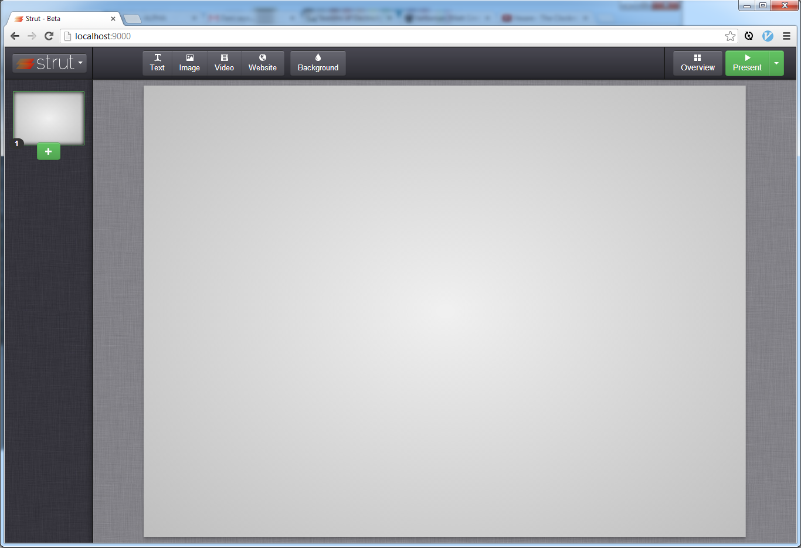

<!--
N.B.: This README was automatically generated by https://github.com/YunoHost/apps/tree/master/tools/README-generator
It shall NOT be edited by hand.
-->

# Strut for YunoHost

[](https://dash.yunohost.org/appci/app/strut)    
[](https://install-app.yunohost.org/?app=strut)

*[Lire ce readme en français.](./README_fr.md)*

> *This package allows you to install Strut quickly and simply on a YunoHost server.
If you don't have YunoHost, please consult [the guide](https://yunohost.org/#/install) to learn how to install it.*

## Overview

Strut is a simple, online editor that doesn't even require registration to operate. Everything you do is recoverable and re-usable.

**Shipped version:** 20220404~ynh1

**Demo:** http://strut.io/dist/

## Screenshots



## Disclaimers / important information

## Limitations
No import/export from/to OpenDocument or pptx.

## Additional information

* This package doesn't contained the exact sources of the upstream https://github.com/tantaman/Strut. 

Initial Strut software includes Google Analytics and is bind to Imgur to upload images. This kind of trackers or external services are not accepted by the package team of YunoHost. So this trackers are removed from sources, a pull request has been done and merged but has finally be removed from the strut upstream with no explanation. In more, Strut developers don't deliver builded versions. To build a version it needs grunt, that can't be removed easily.

To avoid to take time to build this html/js app, this package setups a builded version of Strut with the patch that remove Google Analytics and Imgur dependencies. It is a build of this version https://github.com/tantaman/Strut/commits/6761b141ee7aa622916e2d23cced84ee95618cce . So it's not the more recent version.

## Documentation and resources

* Official app website: http://strut.io
* Upstream app code repository: https://github.com/MohannadNaj/Strut
* YunoHost documentation for this app: https://yunohost.org/app_strut
* Report a bug: https://github.com/YunoHost-Apps/strut_ynh/issues

## Developer info

Please send your pull request to the [testing branch](https://github.com/YunoHost-Apps/strut_ynh/tree/testing).

To try the testing branch, please proceed like that.
```
sudo yunohost app install https://github.com/YunoHost-Apps/strut_ynh/tree/testing --debug
or
sudo yunohost app upgrade strut -u https://github.com/YunoHost-Apps/strut_ynh/tree/testing --debug
```

**More info regarding app packaging:** https://yunohost.org/packaging_apps