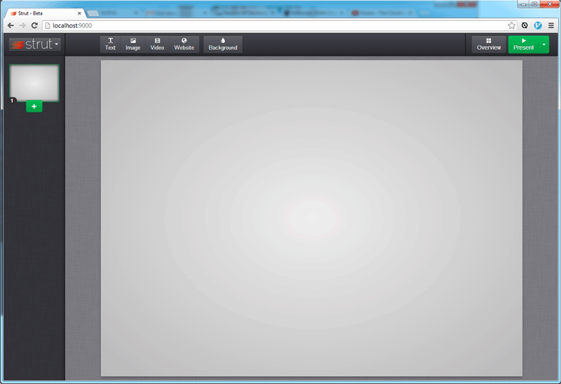

<!--
Важно: этот README был автоматически сгенерирован <https://github.com/YunoHost/apps/tree/master/tools/readme_generator>
Он НЕ ДОЛЖЕН редактироваться вручную.
-->

# Strut для YunoHost

[](https://ci-apps.yunohost.org/ci/apps/strut/)  

[](https://install-app.yunohost.org/?app=strut)

*[Прочтите этот README на других языках.](./ALL_README.md)*

> *Этот пакет позволяет Вам установить Strut быстро и просто на YunoHost-сервер.*  
> *Если у Вас нет YunoHost, пожалуйста, посмотрите [инструкцию](https://yunohost.org/install), чтобы узнать, как установить его.*

## Обзор

Strut is a simple, online editor that doesn't even require registration to operate. Everything you do is recoverable and re-usable.

**Поставляемая версия:** 20231204~ynh2

**Демо-версия:** <http://strut.io/dist/>

## Снимки экрана



## :red_circle: Анти-функции

- **Upstream not maintained**: This software is not maintained anymore. Expect it to break down over time, be exposed to unfixed security breaches, etc.

## Документация и ресурсы

- Официальный веб-сайт приложения: <http://strut.io>
- Репозиторий кода главной ветки приложения: <https://github.com/MohannadNaj/Strut>
- Магазин YunoHost: <https://apps.yunohost.org/app/strut>
- Сообщите об ошибке: <https://github.com/YunoHost-Apps/strut_ynh/issues>

## Информация для разработчиков

Пришлите Ваш запрос на слияние в [ветку `testing`](https://github.com/YunoHost-Apps/strut_ynh/tree/testing).

Чтобы попробовать ветку `testing`, пожалуйста, сделайте что-то вроде этого:

```bash
sudo yunohost app install https://github.com/YunoHost-Apps/strut_ynh/tree/testing --debug
или
sudo yunohost app upgrade strut -u https://github.com/YunoHost-Apps/strut_ynh/tree/testing --debug
```

**Больше информации о пакетировании приложений:** <https://yunohost.org/packaging_apps>
